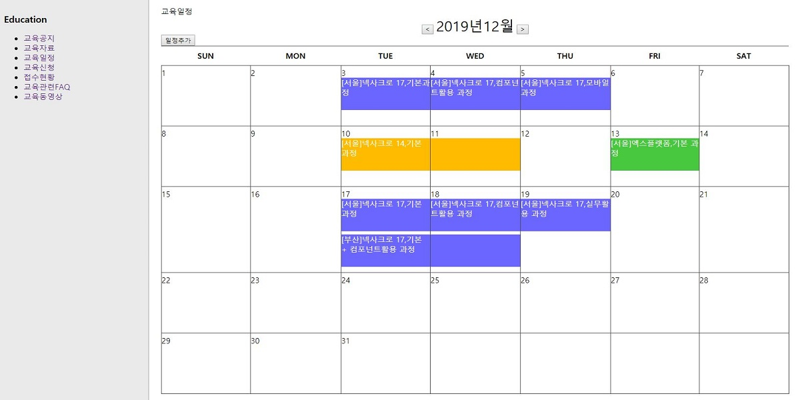
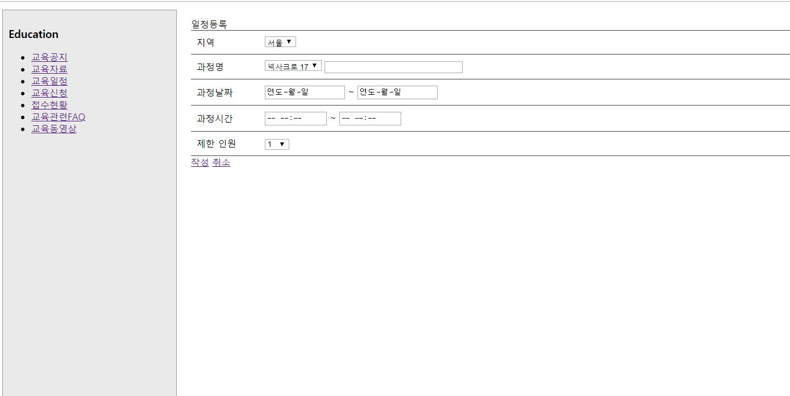

# 교육 일정 관리 웹 사이트
- 투비소프트 고객지원 벤치마킹 http://support.tobesoft.co.kr/Support/index.html

## 개발환경
- 언어
  - Java, JavaScript, Jsp, JSTL, Ajax
- 프레임워크
  - Spring, MyBatis
- 라이브러리
  - JQuery, Lombok, tiles
- DB
  - MySQL
- WAS
  - Tomcat 8.5
- JDK
  - jdk1.8
  
## 교육일정 캘린더
- Controller
    - `src`-`com.spring.board.controller`-`ScheduleController.java `
- View
    - `WebContent`-`WEB-INF`-`views`-`calendar`-`education_calendar.jsp`

## 교육 일정 만들기
- View
    - `WebContent`-`WEB-INF`-`views`-`calendar`-`add_Schedule.jsp`

